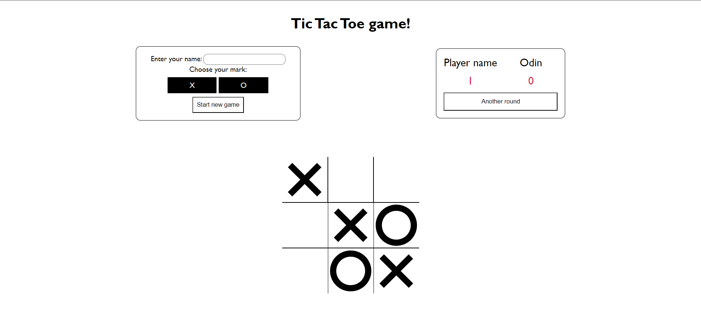

# the-odin-ticTacToe

This is a solution to the the-odin project [Tic tac toe project](https://www.theodinproject.com/lessons/node-path-javascript-tic-tac-toe).

## Table of contents

- [Overview](#overview)
  - [The challenge](#the-challenge)
  - [Screenshot](#screenshot)
  - [Links](#links)
- [My process](#my-process)
  - [Built with](#built-with)
  - [Useful resources](#useful-resources)
- [Author](#author)
- [Acknowledgments](#acknowledgments)

## Overview

### The challenge

- Create a tic tac toe game.
- The main goal is to have as little global code as possible using factory function design pattern.

### Screenshot

### Links

- Solution URL: [solution URL](https://github.com/bashair0/the-odin-ticTacToe)
- Live Site URL: [live site URL](https://bashair0.github.io/the-odin-ticTacToe/)

## My process

### Built with

- Semantic HTML5 markup
- CSS custom properties
- java script

### Useful resources

- [Tic-Tac-Toe with JavaScript](https://alialaa.com/blog/tic-tac-toe-js) - This is an amazing article which helped me with writing the check for win function. and, to print a formatted board to help visualize the game board on the console.
- [Build Tic Tac Toe With JavaScript - Tutorial](https://www.youtube.com/watch?v=Y-GkMjUZsmM) - This youtube tutorial helped me how to use css to draw the X and O marks.

## Author

- github - [bashair0](https://github.com/bashair0)
- Frontend Mentor - [@bashair0](https://www.frontendmentor.io/profile/bashair0)
